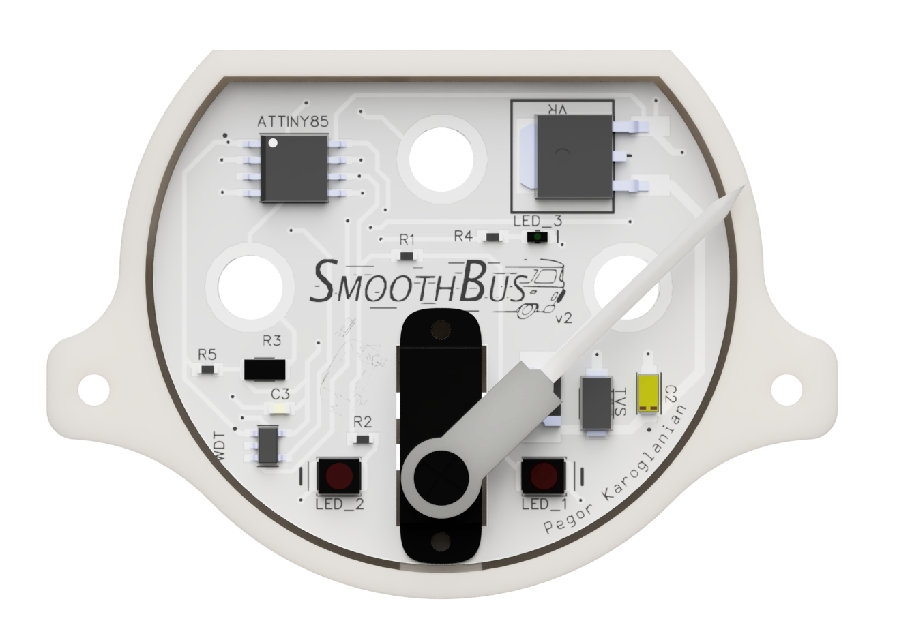
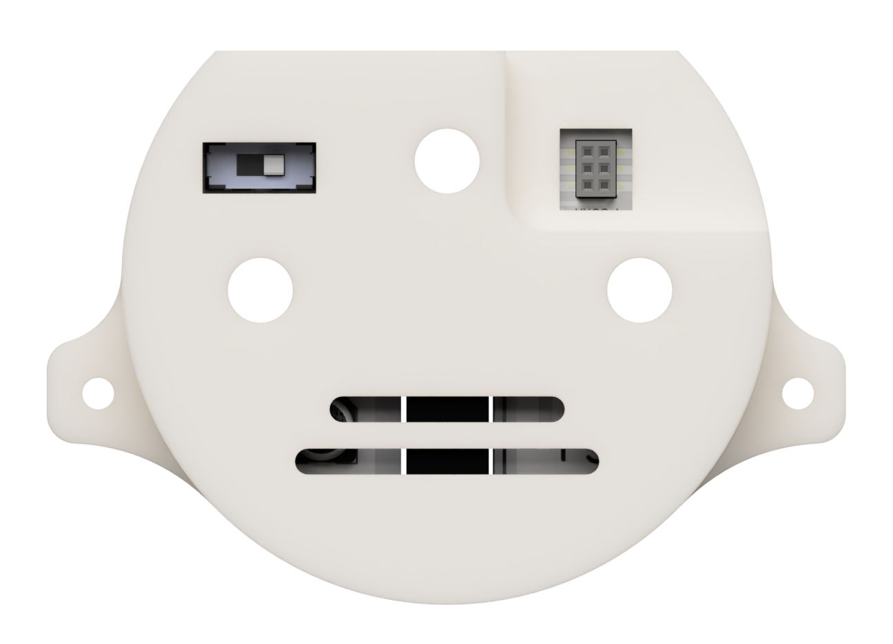
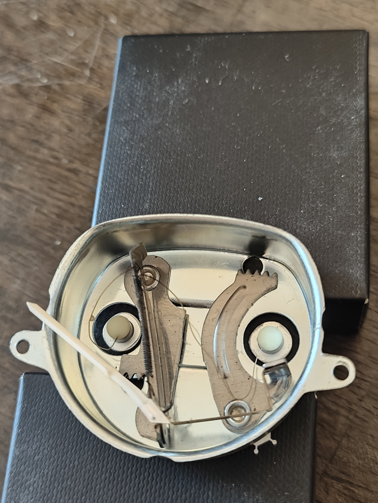
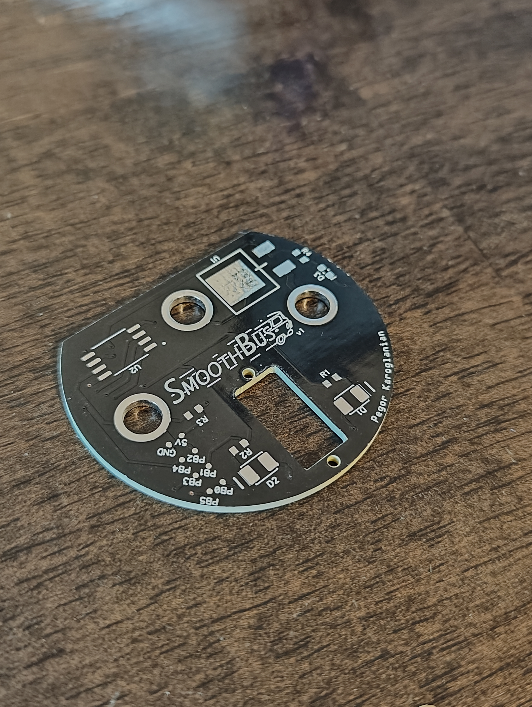
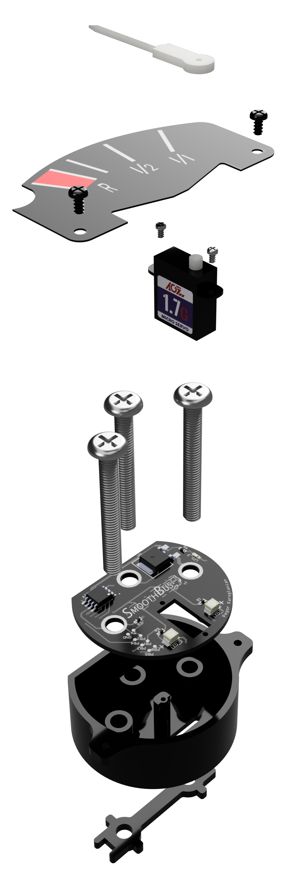
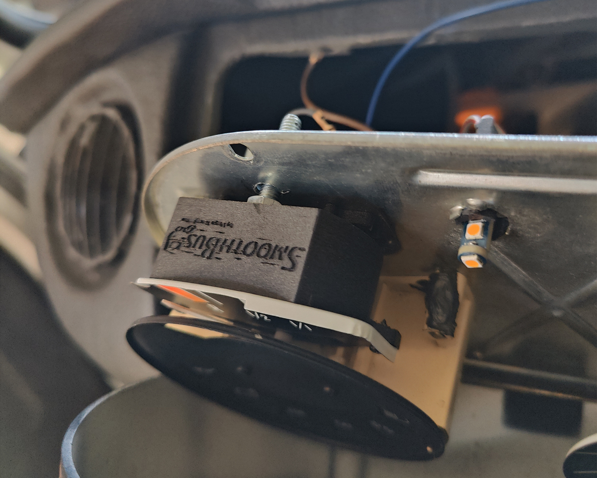
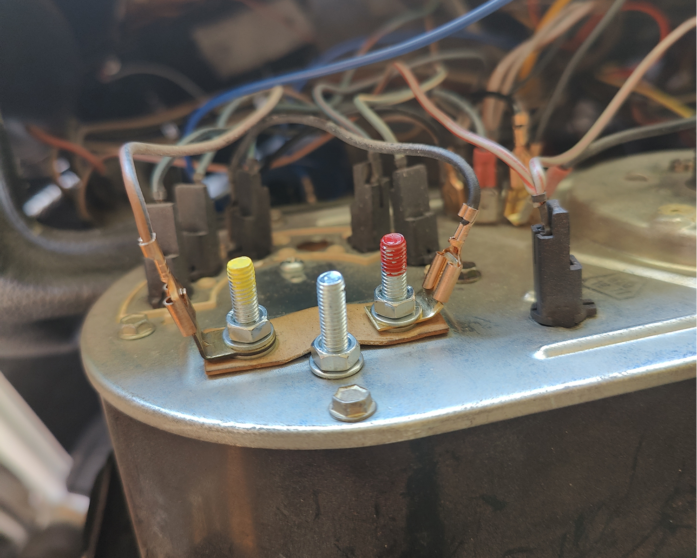

  

# V2 - 2/23/25

    <table>
        <tr>
            <td>
                

                    
                     V2 Front
                

            </td>
            <td>
                

                    
                     V2 Top
                

            </td>
            <td>
                

                    
                      V2 Back
                

            </td>
        </tr>
    </table>

### What's new in V2?
#### Hardware:
* New PCB! Now with input voltage filtering, external watchdog timer, and easier programming connector. 
* Switched to automotive grade ICs (except attiny85, can't find any in stock).
* Reduced voltage divider known resistor value to increase accuracy.
* New 3D printed enclosure to accommodate the new connector, `programming_jig.stl` no longer needed.
#### Software:
* Added new calibration values for fuel sender.
* Added watchdog timer support.
* Increased moving average window size.
* Cleaned up & simplified some chunks of code.
* Removed unused debug.

After getting some feedback on the initial release I decided it was time to put together another build with some improvements that were suggested and also some that I thought would be beneficial. One important change was getting better calibration values from my fuel sender. Previously I was using the data off a forum post that is mentioned below, but I came to realize that my fuel sender (Classic Line 8115800400 from BusDepot) has slightly different readings. I decided to remove it out of the fuel tank and mount it inside a 5 gallon bucket which had lines at the corresponding fuel heights (35mm = R, 75mm = 1/4 tank, 130mm = 1/2 tank, 200mm = Full) and then poured water up to those lines and took multiple readings and averaged them to create the table seen in the code. I left the old values in case it matches someones out there.

In terms of hardware a big improvement is the input voltage filtering, which was completely missing in my original build. Although I didn't run into any power related issues with the first build (at least not for the time I used it), it's better to be safe and this gave me an opportunity to learn a bit more about transient voltages. Speaking of voltages I also upgrade the known resistor R1 in the voltage divider circuit be a lower resistance (50 ohms) and also better rated for the power it's handling. The lower value on this resistor should provide a slightly more accurate reading of the fuel senders position since it's closer to its range. Last new addition I'd like to highlight is the new watchdog timer. I think it's a good failsafe to have in the event there are any funky power glitches that puts the mcu in a bad state. A quick reset from the watchdog in this scenario and we're back up and running and the user wouldn't notice a thing. Hope you enjoy these updates.
 
 

# SmoothBus - 12/4/24
SmoothBus is a fuel gauge conversion for the classic VW Bus. More specifically a 1978 Bus. It's an all in one package with a small form factor that is slightly larger than the original gauge and can be installed with very minimal modifications to the dash. This started as a weekend project after my fuel gauge was showing me readings from all over the place.

The original gauges in the buses are pretty clever in design. I've included a picture of it below. It's pretty simple and if my understanding is correct, the flow of current through it causes the wire to heat up and expand which causes the needle to move to different positions. The current is controlled by the fuel sender float which is located in the fuel tank and is essentially a rheostat. Utilizing this thermal property also smooths out bumps and turns since it takes a second or two for it expand & contract. These things don't normally break, it's the voltage regulator that they are connected to that often goes bad, but what's the fun in replacing that when you can make your own.

    
     Original fuel gauge guts.

The SmoothBus design ditches the old gauge components including the voltage regulator keeping only the fuel sender float which is used as the variable resistor in the voltage divider circuit. The overall process is still pretty simple, the ATTiny85 microcontroller reads the analog voltage on one of its input pins and outputs that value as a servo position that corresponds to the location on the original dial. The positions & values were determined by some very useful investigations that were done in this [samba forum post](https://www.thesamba.com/vw/forum/viewtopic.php?t=693930). The analog voltage that gets inputted is the voltage divider circuit that consists of a known resistor value (100ohms) and the unknown resistor value from the fuel sender which ranges from 10 ohms to 79ohms. There is also a moving average that is happening with each read. The configuration that I found works best has been a moving average window of 35 that has readings every 200ms. All of this can be easily changed in the code that can be found in `src` directory. It should be pretty easy to setup, it was all written in the Arduino IDE with the [ATTinyCore](https://github.com/SpenceKonde/ATTinyCore) library that adds support to a bunch of tinyAVR devices (very cool project).

Programming the board wasn't the most intuitive. I decided to have probe points on the board (bottom left corner of PCB) that I thought would be a good idea to easily program the device, but it ended up being a bit finicky. It required making a jig and using tiny spring loaded probes that were then connected to an Arduino Mega that was used as an ISP (see below). [I thought I learned my lesson last time](https://gitlab.com/_Pegor/kepler_fw/-/tree/master/Hardware?ref_type=heads#programming-jig). I think the rest of design is rather straight forward. It contains a voltage regulator that can handle up to 35V and also has some red LEDs to indicate low fuel level. The schematic is included in `hardware/PCB` along with the gerber zip that you can send to a PCB manufacturer of your choice.

    <table>
        <tr>
            <td>
                

                    
                     PCB
                

            </td>
            <td>
                

                    
                      Programming jig
                

            </td>
        </tr>
    </table>

    
     Render of all the parts.

I have included all the required 3D parts seen in the render above in the `hardware/3D Parts` directory. Everything was printed in GF-ASA so there is no warping due to warmer temperatures. Installation of the gauge required drilling one hole for the ground screw, other than that there was no other modification required to the dash. You can see it installed below. The red screw is the 12v line, the yellow is for the fuel sender, and the middle is ground, that whole backplate is grounded so no need to run additional wires.

    <table>
        <tr>
            <td>
                

                    
                     Installed fuel gauge
                

            </td>
            <td>
                

                    
                      Terminals of the fuel gauge
                

            </td>
        </tr>
    </table>

Lastly here is a picture of the finished product and a gif of it in action. Happy tinkering!

    <table>
        <tr>
            <td>
                

                    
                     Complete build
                

            </td>
            <td>
                

                    
                      GIF of it in action
                

            </td>
        </tr>
    </table>

 
 
Almost forgot! Here is the little loaf if you're curious.

  

